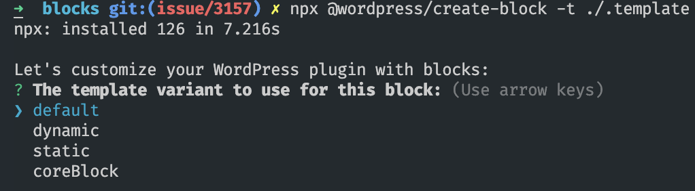
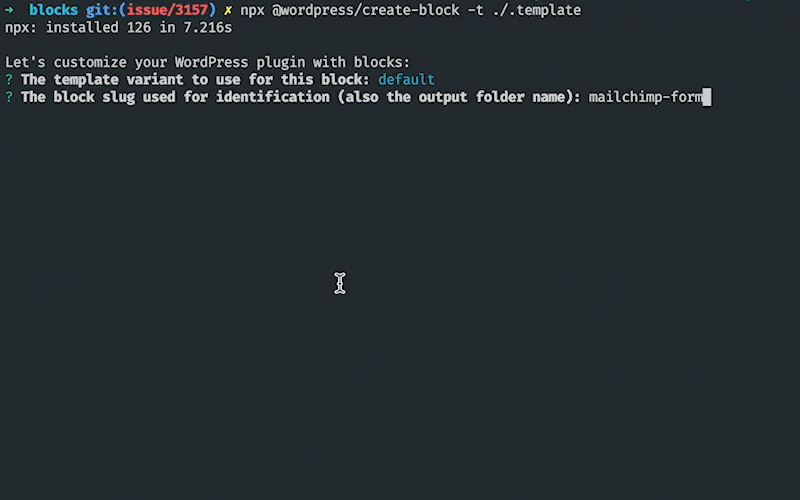

# PRC-Block-Library

Welcome to the Pew Research Center Block Library 👋 ( prc-block-library for short). First some caveats; this is the culmination of a refactor of our various blocks into new block libraries utilizing `@wordpress/create-block` and `@wordpress/scripts` removing our need to use `Wpack.io`, this release also includes a new method for handling asset dependencies across plugins. Given the nature of how we’re handling dependencies some blocks will not work for you until we release our subsequent `prc-scripts` plugin later in Q1 2023. Until then, use at your own risk with the understanding some blocks will not work for you and will cause an error in the editor due to missing components. Furthermore, some blocks will reference post types, taxonomies, and general data models you won’t  have; we have tried our best to ensure backwards compatibility with WP core post types and objects when this is activated off our platform. Some blocks you may have heard us speak about are not present in this collection; our quiz builder, quote sorter builder, and chart builder blocks will be released open source at a later date. This will serve as a base of blocks that other plugins we release will utilize. 

---

PRC Block Library is a collection of blocks for the [Gutenberg](
https://wordpress.org/gutenberg/) editor. Treat this collection with care, as
this provides the foundation for the display layer of the PRC website.

All blocks are built using the [Gutenberg Block API](
https://wordpress.org/gutenberg/handbook/block-api/), and are built using
the WordPress variant of [React](https://reactjs.org/) called [@wordpress/element](
https://wordpress.org/gutenberg/handbook/designers-developers/developers/packages/packages-element/).

### Scaffolding a New Block

To scaffold a new block, run the following command in the `/blocks` directory:

```bash
npx @wordpress/create-block -t ./.template
```

This will start a new block scaffold and prompt you to chose a variant.



The variants are:

 - `default` - Our typical block, this block comes pre-configured with `useInnerBlocks` and `<RichText/>` should you need it. This block uses a render.php file to render the block dynamically on the frontend.
 - `dynamic` - A dynamic block is a default block that needs the functionality of a PHP class to render the block AND/or registering data models, rest endpoints, additional server side functionality. This block uses a `render_callback` function to render the block dynamically on the frontend.
 - `static` - A block that uses static data to render content. This is primarily intended for primitive block types. This saves content as html directly to the database.
 - `coreBlock` - A modification to or extension of a core block. Adding attributes, context, new controls, or new styles to a core block should use this variant.

After choosing a variant you will be prompted for a name and a title. The name should
be in the format `block-name`, where `block-name` is the name of the block you
are creating. For example, if you are creating a block called "My Block", you
would enter `my-block` as the name and "My Block" as the title. This will create a new directory in the
`/blocks` directory called `my-block`. This directory will contain all of the
files you need to build your block.

There are additional options during the scaffold process, but these are not
required. Only name and title are required.



## 3rd Party Dependency Extraction

From time to time you may need to add a script that is included in the `PRC-Scripts` plugin. Scripts whether they have 1st party or 3rd party origins that are commonly used are registered in `PRC-Scripts`. For example, `enquire.js` is a great library for handling media queries in JavaScript. To add this dependency to your block, you'll need to add it to the `package.json` file in your block directory as a dev dependency. You will also need to setup dependency extraction for your block in the `webpack.config.js` file in your block directory. This will allow the dependency to be loaded by WordPress script/style registry.

Using dependency extraction would allow you to import these libraries without including the code in your build e.g.:
```js
import { useDebounce } from '@prc/hooks';
import enquire from 'enquire.js';
```

In the example below we will include support for a 3rd party library called `enquire.js` and a 1st party library called `@prc/hooks`. Respectively their wp script handles are `enquire.js` and `prc-hooks`, their global scoped names are `window.enquire` and `window.prcHooks`, and their package names are `enquire.js` and `@prc/hooks`.

```js
const defaultConfig = require('@wordpress/scripts/config/webpack.config');
const DependencyExtractionWebpackPlugin = require('@wordpress/dependency-extraction-webpack-plugin');

module.exports = {
	...defaultConfig,
	devtool: 'source-map',
	plugins: [
		...defaultConfig.plugins.filter(
			(plugin) =>
				'DependencyExtractionWebpackPlugin' !== plugin.constructor.name,
		),
		new DependencyExtractionWebpackPlugin({
			injectPolyfill: true,
			// eslint-disable-next-line consistent-return
			requestToExternal(request) {
				/* My externals */
				if (request.includes('@prc/hooks')) {
					return 'prcHooks';
				}
				if (request.includes('enquire.js')) {
					return 'enquire';
				}
			},
			// eslint-disable-next-line consistent-return
			requestToHandle(request) {
				// Handle imports like `import myModule from 'my-module'`
				if ('@prc/hooks' === request) {
					// `my-module` depends on the script with the 'my-module-script-handle' handle.
					return 'prc-hooks';
				}
				if ('enquire.js' === request) {
					return 'enquire.js';
				}
			},
		}),
	],
};
```

For an up to date list of all available scripts and their dependency extraction configuration see the [PRC-Scripts](
	https://github.com/pewresearch/pewresearch-org/blob/main/plugins/prc-scripts/webpack.config.js) plugin.


## Guides

## Layout
example

## Colors
example


#### Licensing

This library utilizes Font Awesome for some block icons and interface elements. 

 - Font Awesome Pro 6.2.1 by @fontawesome - https://fontawesome.com License - https://fontawesome.com/license (Commercial License) Copyright 2022 Fonticons, Inc.

This library also utilizes Handsontable for the data-table block.

- Handsontable 9.0.2 by @handsontable - https://handsontable.com License - https://handsontable.com/docs/9.0.2/tutorial-license-info.html (Commercial License) Copyright 2021 Handsontable


#### Contributing

We are not currently accepting contributions to this repository at this time.
