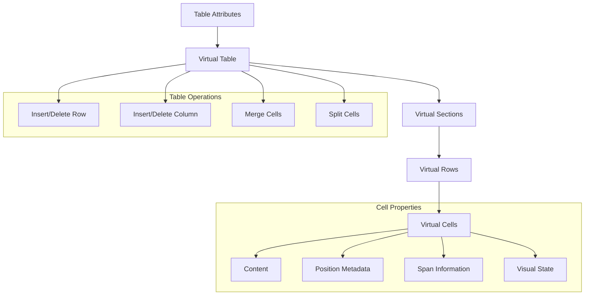

# Table State Management System

## Overview

The Table State Management System is a sophisticated virtual table implementation that handles complex table operations like merging cells, splitting cells, and managing row/column manipulations in a WordPress Gutenberg block context.

## Core Concepts

### Virtual Table (VTable)

The virtual table is an abstraction that represents the actual table structure with additional metadata for managing table operations. It consists of three main sections:

- `head`: Table header section
- `body`: Table body section  
- `foot`: Table footer section

```typescript
type VTable = Record<SectionName, VRow[]>;
```

### Virtual Cell (VCell)

Each cell in the virtual table contains metadata beyond the visible content:

```typescript
interface VCell {
  content: string;
  tag: CellTagValue;
  rowSpan: number;
  colSpan: number;
  sectionName: SectionName;
  rowIndex: number;
  vColIndex: number;
  isHidden: boolean;
  isFirstSelected?: boolean;
  isFilled?: boolean;
}
```

## Architecture Diagram



## Key Operations

### 1. Table Creation

The system creates a virtual table using `createTable()` which initializes the structure with:
- Specified number of rows and columns
- Optional header and footer sections
- Default cell properties

### 2. Row Operations

- `insertRow()`: Inserts a new row at specified index
- `deleteRow()`: Removes a row while maintaining table integrity
- Handles complex scenarios with merged cells

### 3. Column Operations

- `insertColumn()`: Adds a new column at specified index
- `deleteColumn()`: Removes a column while preserving structure
- Manages colspan adjustments automatically

### 4. Cell Merging and Splitting

- `mergeCells()`: Combines selected cells into one
- `splitMergedCells()`: Splits previously merged cells
- Maintains proper cell references and spans

### 5. State Conversion

- `toVirtualTable()`: Converts table attributes to virtual structure
- `toTableAttributes()`: Converts virtual structure back to attributes
- Preserves all necessary metadata during conversions

## Implementation Details

### Virtual Position Tracking

The system maintains two types of positions:
1. **Actual Position**: Physical location in the DOM
2. **Virtual Position**: Location in the virtual table grid

This dual tracking enables:
- Proper handling of merged cells
- Accurate selection mechanics
- Correct rendering of complex table structures

### Cell Selection Logic

The system implements sophisticated selection mechanics:
- Handles rectangular selections
- Manages multi-cell operations
- Prevents invalid selections across sections

### Style Management

Cells maintain style information through:
- Inline style conversion
- Style object management
- Border and padding specific handlers

## Best Practices

1. **State Updates**
   - Always use provided utility functions
   - Avoid direct manipulation of the virtual table
   - Maintain immutability in state updates

2. **Selection Handling**
   - Validate selections before operations
   - Check for section boundaries
   - Handle merged cells appropriately

3. **Style Updates**
   - Use style utility functions
   - Maintain consistent border handling
   - Preserve existing styles when updating

## Error Handling

The system includes various validation checks:
- Section existence verification
- Selection boundary validation
- Merge/split operation validation

## Performance Considerations

1. **Memory Usage**
   - Virtual table maintains minimal necessary state
   - Efficient cell reference tracking
   - Optimized selection state management

2. **Operation Complexity**
   - Most operations run in O(n) time
   - Selection operations optimized for large tables
   - Efficient state conversion methods

## Integration Points

The table state system integrates with:
1. WordPress Block Editor
2. React component system
3. Style management utilities
4. DOM rendering layer

## Example Usage

```typescript
// Create a new table
const vTable = createTable({
  rowCount: 3,
  colCount: 4,
  headerSection: true,
  footerSection: false
});

// Insert a new row
const updatedTable = insertRow(vTable, {
  sectionName: 'body',
  rowIndex: 1
});

// Merge selected cells
const mergedTable = mergeCells(vTable, selectedCells, true);

// Create a virtual table from existing table attributes
const existingTableAttributes = {
  head: [{
    cells: [
      { content: 'Header 1', tag: 'th', colSpan: '2' },
      { content: 'Header 2', tag: 'th' }
    ]
  }],
  body: [{
    cells: [
      { content: 'Cell 1', tag: 'td' },
      { content: 'Cell 2', tag: 'td' },
      { content: 'Cell 3', tag: 'td', rowSpan: '2' }
    ]
  }, {
    cells: [
      { content: 'Cell 4', tag: 'td', colSpan: '2' }
    ]
  }],
  foot: []
};

// Convert table attributes to virtual table
const virtualTable = toVirtualTable(existingTableAttributes);

// The resulting virtualTable will have:
// - A header row with a merged cell (colSpan: 2) and a single cell
// - Two body rows where:
//   - First row has three cells, with the last cell spanning two rows
//   - Second row has a merged cell (colSpan: 2)
// - Virtual positions and metadata for all cells

// Make modifications to the virtual table
const updatedVirtualTable = updateCells(
  virtualTable,
  { 
    styles: { 
      backgroundColor: '#f0f0f0',
      padding: '8px'
    }
  },
  selectedCells
);

// Convert back to table attributes for saving/rendering
const updatedAttributes = toTableAttributes(updatedVirtualTable);
```

## Cell Selection System

### Overview

The cell selection system allows users to select individual or multiple cells for operations like merging, styling, or content manipulation. The system handles complex scenarios including:
- Single cell selection
- Rectangular multi-cell selection
- Selection across merged cells
- Section-aware selection (preventing invalid cross-section selections)

### Selection Types

```typescript
// Virtual table selected cells state
type VSelectedCells = VCell[] | undefined;

// Virtual table selected line state
type VSelectedLine =
  | { sectionName: SectionName; rowIndex: number }  // Row selection
  | { vColIndex: number }                          // Column selection
  | undefined;
```

### Selection Mechanics

1. **Single Cell Selection**
```typescript
// Mark a cell as the first selected cell
const selectedCell: VCell = {
  content: 'Selected Cell',
  tag: 'td',
  rowSpan: 1,
  colSpan: 1,
  sectionName: 'body',
  rowIndex: 0,
  vColIndex: 0,
  isFirstSelected: true,  // Indicates this is the anchor cell
  isHidden: false
};

const selectedCells: VSelectedCells = [selectedCell];
```

2. **Rectangular Selection**
```typescript
// Select a range of cells from start to end point
const fromCell: VCell = {
  sectionName: 'body',
  rowIndex: 0,
  vColIndex: 0,
  // ... other cell properties
};

const toCell: VCell = {
  sectionName: 'body',
  rowIndex: 1,
  vColIndex: 1,
  // ... other cell properties
};

// Get all cells in the rectangular selection
const rectangleSelection = toRectangledSelectedCells(vTable, {
  fromCell,
  toCell
});

// Verify if the selection forms a valid rectangle
const isValid = isRectangleSelected(rectangleSelection);
```

3. **Selection with Merged Cells**
```typescript
// Example of selecting a range that includes merged cells
const selectionWithMerged = toRectangledSelectedCells(vTable, {
  fromCell: { rowIndex: 0, vColIndex: 0, sectionName: 'body' },
  toCell: { rowIndex: 2, vColIndex: 2, sectionName: 'body' }
});

// Check if selection contains merged cells
const hasMerged = hasMergedCells(selectionWithMerged);

// Get the actual range of the selection (accounting for merged cells)
const range = getVirtualRangeIndexes(selectionWithMerged);
```

### Selection Validation

The system includes several validation methods to ensure selections are valid:

```typescript
// Check if selection spans multiple sections
const isMultiSection = isMultiSectionSelected(selectedCells);

// Get the boundaries of the selection
const boundaries = getVirtualRangeIndexes(selectedCells);

// Verify if selection forms a valid rectangle
const canMerge = isRectangleSelected(selectedCells);
```

### Example: Complete Selection Operation

```typescript
// Example of a complete selection operation
function handleCellSelection(vTable: VTable, clickedCell: VCell, isShiftKey: boolean) {
  // Single cell selection
  if (!isShiftKey) {
    return [{ 
      ...clickedCell, 
      isFirstSelected: true 
    }];
  }

  // Find the previously selected anchor cell
  const anchorCell = findFirstSelectedCell(vTable);
  if (!anchorCell) {
    return [clickedCell];
  }

  // Get rectangular selection between anchor and clicked cell
  const selectedCells = toRectangledSelectedCells(vTable, {
    fromCell: anchorCell,
    toCell: clickedCell
  });

  // Validate selection
  if (!isRectangleSelected(selectedCells)) {
    return null; // Invalid selection
  }

  // If selection spans multiple sections, prevent it
  if (isMultiSectionSelected(selectedCells)) {
    return null; // Invalid multi-section selection
  }

  return selectedCells;
}

// Usage example
const vTable = toVirtualTable(existingTableAttributes);
const clickedCell = vTable.body[1].cells[1];
const selection = handleCellSelection(vTable, clickedCell, true);

if (selection) {
  // Perform operation on selected cells
  const updatedTable = updateCells(
    vTable,
    { styles: { backgroundColor: '#f0f0f0' } },
    selection
  );
}
```

### Selection Best Practices

1. **Always Validate Selections**
   - Check for section boundaries
   - Verify rectangular selections
   - Handle merged cells appropriately

2. **Maintain Selection State**
   - Keep track of the anchor cell
   - Update selection state atomically
   - Clear invalid selections

3. **Handle Edge Cases**
   - Merged cells spanning selection boundaries
   - Empty cells
   - Section transitions

4. **Performance Considerations**
   - Cache selection results when possible
   - Optimize range calculations
   - Minimize selection updates
